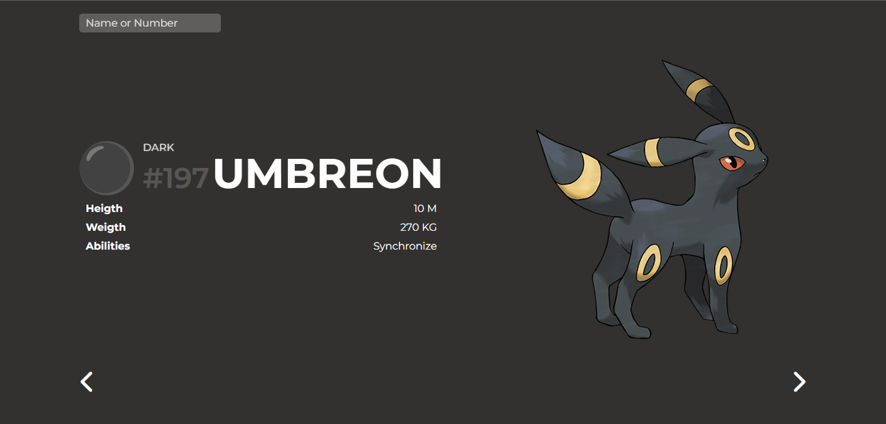

    <section id="projects">
      
#Projects

      

        

          

            

              
            

            

              <h3 class="name-project">Pokedex</h3>
              Lorem ipsum dolor sit amet, consectetur adipiscing elit. Curabitur
                accumsan urna ut augue posuere ullamcorper. Vestibulum congue orci eget felis feugiat congue. In mollis
                condimentum diam non dictum.

              

                
                
              

            

          

          

            

              

                
              

              

                <h3 class="name-project">Weather App</h3>
                Lorem ipsum dolor sit amet, consectetur adipiscing elit. Curabitur
                  accumsan urna ut augue posuere ullamcorper. Vestibulum congue orci eget felis feugiat congue. In
                  mollis condimentum diam non dictum.

                

                  
                  
                

              

            

          

          

            

              

                
              

              

                <h3 class="name-project">Weather App</h3>
                Lorem ipsum dolor sit amet, consectetur adipiscing elit. Curabitur
                  accumsan urna ut augue posuere ullamcorper. Vestibulum congue orci eget felis feugiat congue. In
                  mollis condimentum diam non dictum.

                

                  
                  
                

              

            

          

          

            

              

                
              

              

                <h3 class="name-project">Weather App</h3>
                Lorem ipsum dolor sit amet, consectetur adipiscing elit. Curabitur
                  accumsan urna ut augue posuere ullamcorper. Vestibulum congue orci eget felis feugiat congue. In
                  mollis condimentum diam non dictum.

                

                  
                  
                

              

            

          

          

            

              

                
              

              

                <h3 class="name-project">Weather App</h3>
                Lorem ipsum dolor sit amet, consectetur adipiscing elit. Curabitur
                  accumsan urna ut augue posuere ullamcorper. Vestibulum congue orci eget felis feugiat congue. In
                  mollis condimentum diam non dictum.

                

                  
                  
                

              

            

          

          

            

              

                <lottie-player src="https://assets5.lottiefiles.com/packages/lf20_9n1ybnqo.json"
                  background="transparent" speed="1" style="width: 100%; height: 247px;" loop autoplay></lottie-player>
              

              

                <h3 class="name-project">🚧 Em construção</h3>
                Lorem ipsum dolor sit amet, consectetur adipiscing elit. Curabitur
                  accumsan urna ut augue posuere ullamcorper. Vestibulum congue orci eget felis feugiat congue. In
                  mollis condimentum diam non dictum.

                

                  
                  
                

              

            

          

        

        

      

    </section>

//Project
      
#Skill

      

        

          
//Technologies I come into contact with on a daily basis

          

            <!--HTML-->
            

              <svg width="32" height="36" viewBox="0 0 32 36" fill="none" xmlns="http://www.w3.org/2000/svg">
                <path d="M3.57524 31.7895L0.812317 0.777771H31.1877L28.4248 31.7727L15.9749 35.2222" fill="#E44D26" />
                <path d="M15.9999 32.5851V3.32324H28.4163L26.0469 29.7803" fill="#F16529" />
                <path
                  d="M6.45538 7.11584H16V10.917H10.6249L10.9765 14.8102H16V18.6029H7.49357L6.45538 7.11584ZM7.66102 20.5118H11.4789L11.7468 23.5511L16 24.6897V28.6583L8.19686 26.4814"
                  fill="#EBEBEB" />
                <path
                  d="M25.511 7.11584H15.9831V10.917H25.1593L25.511 7.11584ZM24.8161 14.8102H15.9831V18.6113H20.6717L20.2279 23.5511L15.9831 24.6897V28.6415L23.7695 26.4814"
                  fill="white" />
              </svg>

            

            <!--CSS-->
            

              <svg width="32" height="36" viewBox="0 0 32 36" fill="none" xmlns="http://www.w3.org/2000/svg">
                <path d="M31.1857 0.777771L28.4188 31.7742L15.9814 35.2222L3.57831 31.779L0.814331 0.777771H31.1857Z"
                  fill="#264DE4" />
                <path d="M26.05 29.8004L28.4145 3.31256H16V32.5867L26.05 29.8004Z" fill="#2965F1" />
                <path d="M7.1507 14.8105L7.49147 18.6127H16V14.8105H7.1507Z" fill="#EBEBEB" />
                <path d="M16 7.11475H15.9869H6.46597L6.81161 10.917H16V7.11475Z" fill="#EBEBEB" />
                <path
                  d="M16 28.6409V24.6851L15.9833 24.6895L11.7488 23.5461L11.4781 20.5137H9.42049H7.66135L8.19403 26.4836L15.9825 28.6458L16 28.6409Z"
                  fill="#EBEBEB" />
                <path
                  d="M20.6688 18.6126L20.2275 23.5437L15.9869 24.6883V28.644L23.7815 26.4837L23.8387 25.8413L24.7322 15.8314L24.825 14.8104L25.5114 7.11475H15.9869V10.917H21.3445L20.9986 14.8104H15.9869V18.6126H20.6688Z"
                  fill="white" />
              </svg>

            

            <!--Bootstrap-->
            

              <svg width="36" height="28" viewBox="0 0 36 28" fill="none" xmlns="http://www.w3.org/2000/svg">
                <path fill-rule="evenodd" clip-rule="evenodd"
                  d="M7.93199 0.28064C5.96664 0.28064 4.51237 2.00084 4.57749 3.86636C4.63999 5.65861 4.55879 7.97985 3.97444 9.87281C3.38801 11.7711 2.39693 12.974 0.777771 13.1284V14.8716C2.39693 15.0264 3.38801 16.2287 3.97438 18.1272C4.55879 20.0202 4.63992 22.3414 4.57742 24.1337C4.5123 25.9989 5.96657 27.7194 7.93226 27.7194H28.0706C30.036 27.7194 31.49 25.9992 31.4248 24.1337C31.3624 22.3414 31.4436 20.0202 32.0279 18.1272C32.6143 16.2287 33.603 15.0259 35.2222 14.8716V13.1284C33.6031 12.9737 32.6144 11.7714 32.0279 9.87281C31.4435 7.98012 31.3624 5.65861 31.4248 3.86636C31.49 2.00111 30.036 0.28064 28.0706 0.28064H7.93172H7.93199ZM24.13 17.171C24.13 19.7397 22.2139 21.2976 19.0342 21.2976H13.6214C13.4666 21.2976 13.3181 21.2361 13.2086 21.1266C13.0991 21.0171 13.0376 20.8686 13.0376 20.7138V7.28632C13.0376 7.13148 13.0991 6.98299 13.2086 6.8735C13.3181 6.76402 13.4666 6.70251 13.6214 6.70251H19.0034C21.6547 6.70251 23.3948 8.13868 23.3948 10.3437C23.3948 11.8913 22.2242 13.2768 20.7329 13.5195V13.6003C22.763 13.823 24.13 15.229 24.13 17.171ZM18.444 8.55316H15.3577V12.9125H17.9571C19.9666 12.9125 21.0746 12.1034 21.0746 10.657C21.0744 9.30159 20.1218 8.55316 18.444 8.55316ZM15.3577 14.6422V19.4463H18.5576C20.6498 19.4463 21.758 18.6068 21.758 17.0291C21.758 15.4514 20.6187 14.642 18.423 14.642H15.3577V14.6422Z"
                  fill="#7952B3" />
              </svg>

            

            <!--JavaScript-->
            

              <svg width="36" height="36" viewBox="0 0 36 36" fill="none" xmlns="http://www.w3.org/2000/svg">
                <path d="M35.2222 0.777771H0.777771V35.2222H35.2222V0.777771Z" fill="#F7DF1E" />
                <path
                  d="M23.9157 27.6876C24.6095 28.8205 25.5122 29.6532 27.1086 29.6532C28.4498 29.6532 29.3065 28.9829 29.3065 28.0567C29.3065 26.9468 28.4263 26.5537 26.9501 25.908L26.1409 25.5608C23.8052 24.5658 22.2536 23.3192 22.2536 20.6839C22.2536 18.2564 24.1032 16.4084 26.9938 16.4084C29.0517 16.4084 30.5312 17.1247 31.5973 19L29.0769 20.6183C28.5219 19.6233 27.9233 19.2313 26.9938 19.2313C26.0458 19.2313 25.4449 19.8327 25.4449 20.6183C25.4449 21.5893 26.0463 21.9824 27.435 22.5838L28.2442 22.9305C30.9943 24.1098 32.547 25.3121 32.547 28.0151C32.547 30.9292 30.2578 32.5257 27.1835 32.5257C24.1776 32.5257 22.2356 31.0933 21.2853 29.2158L23.9157 27.6876ZM12.4818 27.9681C12.9902 28.8702 13.4528 29.6329 14.5648 29.6329C15.6282 29.6329 16.2991 29.2169 16.2991 27.5991V16.5932H19.5358V27.6428C19.5358 30.9943 17.5708 32.5197 14.7026 32.5197C12.1111 32.5197 10.6103 31.1786 9.84705 29.5632L12.4818 27.9681Z"
                  fill="black" />
              </svg>

            

            <!--React.JS-->
            

              <svg width="36" height="36" viewBox="0 0 36 36" fill="none" xmlns="http://www.w3.org/2000/svg">
                <path
                  d="M18 21.0368C19.6771 21.0368 21.0367 19.6772 21.0367 18.0001C21.0367 16.323 19.6771 14.9634 18 14.9634C16.3229 14.9634 14.9633 16.323 14.9633 18.0001C14.9633 19.6772 16.3229 21.0368 18 21.0368Z"
                  fill="#61DAFB" />
                <path
                  d="M18 24.2216C26.9992 24.2216 34.2945 21.4362 34.2945 18.0001C34.2945 14.564 26.9992 11.7786 18 11.7786C9.0008 11.7786 1.70551 14.564 1.70551 18.0001C1.70551 21.4362 9.0008 24.2216 18 24.2216Z"
                  stroke="#61DAFB" stroke-width="2" />
                <path
                  d="M12.612 21.1108C17.1116 28.9044 23.1715 33.8295 26.1472 32.1115C29.123 30.3935 27.8876 22.6828 23.388 14.8893C18.8884 7.09574 12.8285 2.17057 9.85274 3.8886C6.87703 5.60663 8.11238 13.3173 12.612 21.1108Z"
                  stroke="#61DAFB" stroke-width="2" />
                <path
                  d="M12.612 14.8893C8.11238 22.6828 6.87702 30.3935 9.85274 32.1115C12.8285 33.8296 18.8884 28.9044 23.388 21.1108C27.8876 13.3173 29.123 5.60665 26.1472 3.88862C23.1715 2.17059 17.1116 7.09576 12.612 14.8893Z"
                  stroke="#61DAFB" stroke-width="2" />
              </svg>

            

            <!--Node.JS-->
            

              <svg width="32" height="36" viewBox="0 0 32 36" fill="none" xmlns="http://www.w3.org/2000/svg">
                <path
                  d="M14.5897 1.14531C15.4438 0.656445 16.5562 0.654237 17.4095 1.14531C21.7026 3.57108 25.9969 5.99306 30.2892 8.42031C31.0965 8.87506 31.6365 9.77354 31.6283 10.7038V25.2982C31.6343 26.267 31.041 27.1869 30.1892 27.6313C25.9103 30.0438 21.6336 32.4591 17.3554 34.8715C16.4837 35.3699 15.349 35.3315 14.5045 34.7923C13.2217 34.0486 11.9366 33.3086 10.6537 32.5657C10.3915 32.4094 10.096 32.285 9.9109 32.0308C10.0746 31.8103 10.3671 31.7828 10.6049 31.6865C11.1404 31.5162 11.6322 31.2429 12.1241 30.9777C12.2485 30.8925 12.4003 30.9252 12.5196 31.0014C13.6166 31.6303 14.7038 32.2775 15.8045 32.9005C16.0393 33.036 16.277 32.8561 16.4777 32.7442C20.6766 30.371 24.8807 28.0069 29.0789 25.633C29.2344 25.5581 29.3204 25.393 29.3078 25.2226C29.3107 20.4082 29.3085 15.593 29.3093 10.7786C29.3271 10.5853 29.2152 10.4075 29.0404 10.3284C24.7763 7.92703 20.5145 5.52199 16.2511 3.12001C16.1773 3.06923 16.0898 3.04198 16.0001 3.04185C15.9105 3.04172 15.8229 3.06871 15.7489 3.11927C11.4856 5.52199 7.22444 7.92924 2.96111 10.3305C2.78692 10.4097 2.67001 10.5845 2.69074 10.7786C2.69147 15.593 2.69074 20.4082 2.69074 25.2234C2.68335 25.3065 2.70161 25.3899 2.74306 25.4624C2.78451 25.5348 2.84717 25.5928 2.92259 25.6286C4.06028 26.2737 5.19944 26.9143 6.33787 27.5573C6.97921 27.9025 7.76667 28.1076 8.47327 27.8431C9.09683 27.6194 9.53392 26.9831 9.52202 26.3211C9.52791 21.5348 9.51908 16.7477 9.52644 11.9622C9.51086 11.7497 9.71242 11.5742 9.919 11.5942C10.4656 11.5905 11.013 11.5868 11.5597 11.5956C11.7878 11.5905 11.9449 11.8193 11.9166 12.0333C11.9144 16.8499 11.9225 21.6666 11.913 26.4832C11.9144 27.7669 11.3871 29.1637 10.1997 29.7918C8.7369 30.5495 6.92892 30.3888 5.48381 29.6622C4.23276 29.0378 3.03889 28.3009 1.81005 27.632C0.956112 27.19 0.365677 26.2663 0.371688 25.2983V10.7038C0.362732 9.75428 0.924216 8.83949 1.75669 8.39136C6.03486 5.97699 10.3123 3.56078 14.5897 1.14531Z"
                  fill="#8CC84B" />
                <path
                  d="M18.322 11.255C20.1879 11.1349 22.1854 11.1838 23.8644 12.103C25.1644 12.8074 25.8851 14.2858 25.9081 15.73C25.8718 15.9248 25.6681 16.0323 25.4822 16.0189C24.9408 16.0182 24.3993 16.0263 23.8579 16.0153C23.6283 16.0241 23.4948 15.8123 23.466 15.6093C23.3104 14.9183 22.9336 14.2339 22.2832 13.9006C21.2847 13.4007 20.127 13.4258 19.0383 13.4363C18.2435 13.4785 17.3888 13.5473 16.7154 14.0147C16.1985 14.3687 16.0415 15.0834 16.226 15.659C16.3999 16.0723 16.877 16.2056 17.2673 16.3286C19.516 16.9167 21.8988 16.8582 24.1045 17.6321C25.0177 17.9476 25.911 18.561 26.2236 19.5171C26.6325 20.7986 26.4533 22.3303 25.5415 23.3591C24.8022 24.2057 23.7253 24.6664 22.6513 24.9167C21.2225 25.2353 19.7397 25.2434 18.2887 25.1019C16.9243 24.9464 15.5045 24.5879 14.4512 23.6583C13.5505 22.8762 13.1106 21.6577 13.1543 20.4816C13.1647 20.283 13.3625 20.1445 13.5527 20.1608C14.0979 20.1564 14.6431 20.1549 15.1883 20.1615C15.406 20.146 15.5674 20.3342 15.5786 20.5394C15.6792 21.1978 15.9266 21.8888 16.5008 22.2792C17.6088 22.994 18.999 22.945 20.2677 22.965C21.3188 22.9184 22.4987 22.9043 23.3564 22.2096C23.809 21.8134 23.9431 21.1504 23.8208 20.5801C23.6883 20.0986 23.1846 19.8742 22.752 19.7275C20.5322 19.0253 18.1228 19.2801 15.9244 18.4861C15.032 18.1707 14.1689 17.5743 13.8261 16.6575C13.3476 15.3598 13.5669 13.7547 14.5741 12.7607C15.5563 11.7719 16.974 11.3911 18.322 11.2548V11.255Z"
                  fill="#8CC84B" />
              </svg>

            

            <!--SQL-->
            

              <svg width="32" height="32" viewBox="0 0 101 100" fill="none" xmlns="http://www.w3.org/2000/svg">
                <path
                  d="M92.3193 77.1365C86.8784 76.9988 82.6616 77.5512 79.1249 79.0698C78.1046 79.4837 76.4721 79.4841 76.336 80.7959C76.8802 81.3483 76.9482 82.2459 77.4244 83.005C78.2414 84.3855 79.6687 86.2498 80.961 87.2168C82.3891 88.3211 83.8179 89.4255 85.3136 90.3921C87.9664 92.0492 90.9593 93.0155 93.5436 94.6726C95.0405 95.6384 96.5358 96.882 98.0322 97.9173C98.7804 98.4689 99.2562 99.3673 100.209 99.7121V99.5054C99.7323 98.8836 99.5963 97.9864 99.1205 97.2959C98.4411 96.6055 97.7601 95.984 97.0799 95.2936C95.1077 92.6016 92.6594 90.254 90.007 88.3211C87.8307 86.8021 83.0693 84.7311 82.1854 82.1764C82.1854 82.1764 82.117 82.1078 82.0494 82.0387C83.5454 81.9007 85.3136 81.3483 86.7424 80.934C89.0547 80.3122 91.1629 80.4507 93.5436 79.8293C94.6316 79.5531 95.7199 79.2079 96.8078 78.8626V78.2416C95.5843 76.9988 94.7 75.3421 93.4076 74.1683C89.939 71.1299 86.1298 68.1617 82.1854 65.6765C80.0768 64.2955 77.356 63.3979 75.1117 62.2246C74.2962 61.8099 72.9354 61.6031 72.4597 60.9127C71.2349 59.3941 70.5547 57.3921 69.6708 55.597C67.699 51.7994 65.7941 47.5884 64.0936 43.5845C62.87 40.8918 62.1217 38.199 60.6253 35.7141C53.62 23.9775 46.0025 16.8666 34.3045 9.89333C31.7878 8.44376 28.7953 7.82235 25.5987 7.06324C23.899 6.9938 22.1981 6.8561 20.498 6.78666C19.4096 6.30334 18.3213 4.99186 17.369 4.37045C13.493 1.8848 3.49442 -3.49959 0.637951 3.61134C-1.1986 8.09853 3.35877 12.5167 4.92245 14.7956C6.07958 16.3832 7.57525 18.178 8.39149 19.9732C8.86764 21.1462 9.00329 22.3898 9.47943 23.6323C10.5681 26.6691 11.5877 30.0527 13.0165 32.8836C13.7647 34.3332 14.5806 35.8518 15.5329 37.1637C16.077 37.9228 17.0289 38.2684 17.2334 39.5108C16.2815 40.8918 16.2131 42.9631 15.6685 44.6889C13.2202 52.4903 14.1728 62.1555 17.6411 67.8855C18.729 69.6109 21.3138 73.4092 24.7825 71.9588C27.8434 70.7164 27.1632 66.7812 28.0467 63.3293C28.2515 62.5 28.1155 61.9484 28.5232 61.396V61.5345C29.4755 63.467 30.4274 65.3316 31.3116 67.2645C33.4203 70.647 37.0926 74.1683 40.1531 76.5159C41.786 77.7579 43.078 79.8983 45.1186 80.6578V80.4503H44.9822C44.574 79.8289 43.9619 79.5531 43.4181 79.0694C42.1941 77.8273 40.8333 76.3083 39.8814 74.9274C37.0253 71.0609 34.5082 66.7808 32.2639 62.3623C31.176 60.2226 30.2233 57.8751 29.3394 55.735C28.9309 54.9057 28.9309 53.6637 28.2511 53.2498C27.2308 54.7684 25.7347 56.0803 24.9865 57.9441C23.6949 60.9127 23.5585 64.5717 23.0823 68.3685C22.8103 68.4383 22.9459 68.3685 22.8099 68.5073C20.634 67.9542 19.8858 65.6765 19.0691 63.7432C17.0285 58.8417 16.6884 50.9713 18.4573 45.3103C18.9335 43.8603 20.9741 39.3041 20.1579 37.9232C19.7497 36.6113 18.3889 35.8518 17.6411 34.8165C16.7572 33.5046 15.8045 31.8483 15.1928 30.398C13.5603 26.5318 12.744 22.2514 10.9759 18.3852C10.1596 16.59 8.73199 14.7265 7.57525 13.0694C6.28325 11.2056 4.85482 9.89333 3.83452 7.68425C3.49481 6.92515 3.01827 5.68232 3.56244 4.85377C3.69848 4.3014 3.97017 4.09466 4.51472 3.95657C5.39899 3.19667 7.91574 4.16331 8.79923 4.57759C11.316 5.61248 13.4242 6.57992 15.5329 8.02948C16.4847 8.71994 17.5051 10.0318 18.729 10.377H20.1575C22.3341 10.86 24.7821 10.5151 26.8227 11.1362C30.4278 12.3095 33.692 14.0357 36.6168 15.8999C45.5267 21.6299 52.8714 29.7766 57.8368 39.5108C58.6531 41.0981 58.9928 42.5489 59.741 44.2052C61.1698 47.5884 62.938 51.0403 64.3656 54.3541C65.7941 57.5985 67.1541 60.9127 69.1947 63.6055C70.215 65.0547 74.2954 65.8146 76.132 66.5741C77.4924 67.1951 79.601 67.7478 80.825 68.5069C83.1373 69.9561 85.4496 71.614 87.6263 73.2013C88.7146 74.0298 92.1148 75.756 92.3193 77.1365Z"
                  fill="#00546B" />
                <path
                  d="M22.9455 17.142C21.7896 17.142 20.9737 17.2809 20.1575 17.4876V17.6257H20.2935C20.8381 18.7304 21.7896 19.4899 22.4694 20.4562C23.0139 21.5605 23.4897 22.6656 24.0342 23.7704C24.1019 23.7009 24.1699 23.6323 24.1699 23.6323C25.1226 22.9414 25.5983 21.8371 25.5983 20.18C25.1902 19.6971 25.1222 19.2137 24.7821 18.7304C24.3743 18.0396 23.4897 17.6947 22.9455 17.142Z"
                  fill="#00546B" />
              </svg>

            

            <!--Github-->
            

              <svg width="36" height="34" viewBox="0 0 36 34" fill="none" xmlns="http://www.w3.org/2000/svg">
                <path
                  d="M18.0001 0.202881C8.48968 0.202881 0.777771 7.91344 0.777771 17.4252C0.777771 25.0346 5.71247 31.4902 12.5555 33.7675C13.4161 33.9268 13.7322 33.3939 13.7322 32.9389C13.7322 32.5283 13.7161 31.1715 13.7088 29.7325C8.91745 30.7743 7.90644 27.7005 7.90644 27.7005C7.12302 25.7098 5.99423 25.1806 5.99423 25.1806C4.43172 24.1116 6.11201 24.1335 6.11201 24.1335C7.84147 24.2551 8.75212 25.9083 8.75212 25.9083C10.2882 28.5413 12.781 27.78 13.7638 27.3401C13.9183 26.2268 14.3647 25.4672 14.8572 25.0371C11.032 24.6015 7.01064 23.1248 7.01064 16.5257C7.01064 14.6455 7.68344 13.1091 8.78521 11.903C8.60638 11.4692 8.01693 9.71759 8.95203 7.34533C8.95203 7.34533 10.3982 6.88243 13.6894 9.11071C15.0631 8.729 16.5364 8.53774 18.0001 8.53125C19.4637 8.53774 20.9381 8.729 22.3145 9.11071C25.6017 6.88243 27.0459 7.34533 27.0459 7.34533C27.9833 9.71759 27.3936 11.4692 27.2148 11.903C28.319 13.1091 28.9872 14.6454 28.9872 16.5257C28.9872 23.1404 24.9583 24.5971 21.1233 25.0233C21.741 25.5578 22.2914 26.606 22.2914 28.2127C22.2914 30.517 22.2714 32.3716 22.2714 32.9389C22.2714 33.3972 22.5814 33.9343 23.4545 33.7652C30.2937 31.4853 35.2222 25.032 35.2222 17.4252C35.2222 7.91344 27.5114 0.202881 18.0001 0.202881Z"
                  fill="black" />
                <path
                  d="M7.22806 24.7364C7.19024 24.8219 7.05544 24.8476 6.93293 24.789C6.80799 24.7328 6.73775 24.6161 6.77827 24.5302C6.81542 24.4421 6.95022 24.4175 7.07489 24.4767C7.2001 24.5328 7.27142 24.6505 7.22806 24.7364ZM8.07523 25.4923C7.99311 25.5685 7.83251 25.5331 7.7235 25.4127C7.61085 25.2927 7.58978 25.1322 7.67312 25.0548C7.75781 24.9788 7.91355 25.0143 8.02647 25.1345C8.13912 25.2559 8.161 25.4154 8.0751 25.4924L8.07523 25.4923ZM8.65645 26.4594C8.55082 26.5328 8.3782 26.464 8.27163 26.3108C8.16613 26.1578 8.16613 25.9741 8.27392 25.9005C8.3809 25.8269 8.55082 25.8931 8.65888 26.045C8.76423 26.2008 8.76423 26.3844 8.65631 26.4595L8.65645 26.4594ZM9.63923 27.5796C9.54481 27.6836 9.34382 27.6557 9.1966 27.5136C9.04613 27.3748 9.00412 27.1777 9.0988 27.0736C9.1943 26.9693 9.3965 26.9986 9.54481 27.1395C9.69434 27.2781 9.73999 27.4766 9.63936 27.5796H9.63923ZM10.9094 27.9578C10.868 28.0926 10.6743 28.1539 10.4792 28.0966C10.2845 28.0376 10.157 27.8796 10.1963 27.7433C10.2368 27.6075 10.4313 27.5436 10.6278 27.605C10.8223 27.6637 10.9501 27.8205 10.9096 27.9578H10.9094ZM12.3552 28.1181C12.3601 28.2602 12.1946 28.378 11.9899 28.3805C11.7839 28.385 11.6174 28.27 11.6152 28.1304C11.6152 27.9869 11.7769 27.8702 11.9827 27.8669C12.1875 27.8628 12.3552 27.9769 12.3552 28.1181ZM13.7754 28.0637C13.8 28.2022 13.6576 28.3446 13.4543 28.3824C13.2544 28.4189 13.0694 28.3334 13.0438 28.196C13.019 28.0539 13.1641 27.9117 13.3636 27.8748C13.5672 27.8394 13.7495 27.9228 13.7754 28.0637Z"
                  fill="black" />
              </svg>
            

            <!--Git-->
            

              <svg width="36" height="36" viewBox="0 0 36 36" fill="none" xmlns="http://www.w3.org/2000/svg">
                <path
                  d="M34.5726 16.4654L19.5338 1.4274C18.6683 0.56131 17.2636 0.56131 16.397 1.4274L13.2741 4.55027L17.2356 8.51179C18.1562 8.20071 19.2119 8.40939 19.9457 9.14322C20.683 9.88176 20.8902 10.9464 20.5716 11.87L24.3894 15.6879C25.3131 15.3697 26.3789 15.5756 27.1166 16.3145C28.1476 17.3452 28.1476 19.0156 27.1166 20.0469C26.0853 21.0784 24.4149 21.0784 23.383 20.0469C22.6075 19.2706 22.4159 18.1316 22.8085 17.1762L19.2481 13.6158L19.2477 22.9853C19.5058 23.1129 19.7415 23.2815 19.9457 23.4845C20.9767 24.5151 20.9767 26.1857 19.9457 27.2178C18.9144 28.2487 17.2432 28.2487 16.2133 27.2178C15.1823 26.1857 15.1823 24.5153 16.2133 23.4846C16.4604 23.2374 16.754 23.0416 17.0773 22.9086V13.4517C16.7536 13.3196 16.4598 13.1237 16.2133 12.8757C15.4321 12.0956 15.2443 10.9494 15.6446 9.99021L11.7394 6.08466L1.42764 16.3958C0.561148 17.2627 0.561148 18.6675 1.42764 19.5337L16.4667 34.572C17.3325 35.4382 18.7369 35.4382 19.6038 34.572L34.5725 19.6036C35.4387 18.7371 35.4387 17.3314 34.5725 16.4654"
                  fill="#DE4C36" />
              </svg>

            

            <!--Insomnia-->
            

              <svg width="32" height="32" viewBox="0 0 101 101" fill="none" xmlns="http://www.w3.org/2000/svg">
                <path
                  d="M50.0369 97.646C76.2472 97.646 97.4947 76.3985 97.4947 50.1882C97.4947 23.9782 76.2472 2.73071 50.0369 2.73071C23.8269 2.73071 2.57935 23.9782 2.57935 50.1882C2.57935 76.3985 23.8269 97.646 50.0369 97.646Z"
                  fill="white" />
                <path
                  d="M50.0372 0.188232C22.423 0.188232 0.0372314 22.574 0.0372314 50.1882C0.0372314 77.8026 22.423 100.188 50.0372 100.188C77.6516 100.188 100.037 77.8026 100.037 50.1882C100.037 22.574 77.6516 0.188232 50.0372 0.188232ZM50.0372 5.27298C74.8432 5.27298 94.9525 25.3822 94.9525 50.1882C94.9525 74.9942 74.8432 95.1035 50.0372 95.1035C25.2312 95.1035 5.12198 74.9942 5.12198 50.1882C5.12198 25.3822 25.2312 5.27298 50.0372 5.27298Z"
                  fill="#4000BF" />
                <path fill-rule="evenodd" clip-rule="evenodd"
                  d="M50.6022 14.5952C70.26 14.5952 86.1957 30.5307 86.1957 50.1886C86.1957 69.8461 70.26 85.7817 50.6022 85.7817C30.9448 85.7817 15.0092 69.8461 15.0092 50.1886C15.0092 45.3842 15.9609 40.8023 17.6863 36.6211C20.2055 40.0517 24.2682 42.2789 28.8509 42.2789C36.4957 42.2789 42.6928 36.0817 42.6928 28.437C42.6928 23.8542 40.4657 19.7916 37.0347 17.2724C41.2163 15.547 45.7982 14.5952 50.6022 14.5952Z"
                  fill="url(#paint0_linear_31_34)" />
                <defs>
                  <linearGradient id="paint0_linear_31_34" x1="50.6022" y1="85.7817" x2="50.6022" y2="14.5952"
                    gradientUnits="userSpaceOnUse">
                    <stop stop-color="#7400E1" />
                    <stop offset="1" stop-color="#4000BF" />
                  </linearGradient>
                </defs>
              </svg>

            

          

        

      
